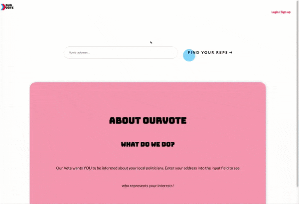

  
  
Civic information aggregator to encourage voter engagement.

<main style="margin-top:30px">
  <h1>About</h1>
  
Given the user's address, OurVote provides information about their political representatives. 

  
This repo was forked from a product I worked on with a team. My contributions centered on the backend:

  <ul>
    <li>modeled and implemented a relational database to store politician data</li>
    <li>implemented a RESTful API to serve database requests</li> 
    <li>wrote unit tests for database functionality</li>
    <li>configured ESLint and Prettier to enforce a consistent code style</li>
  </ul>
</main>

<h1 style="margin-top:30px">Preview</h1>
